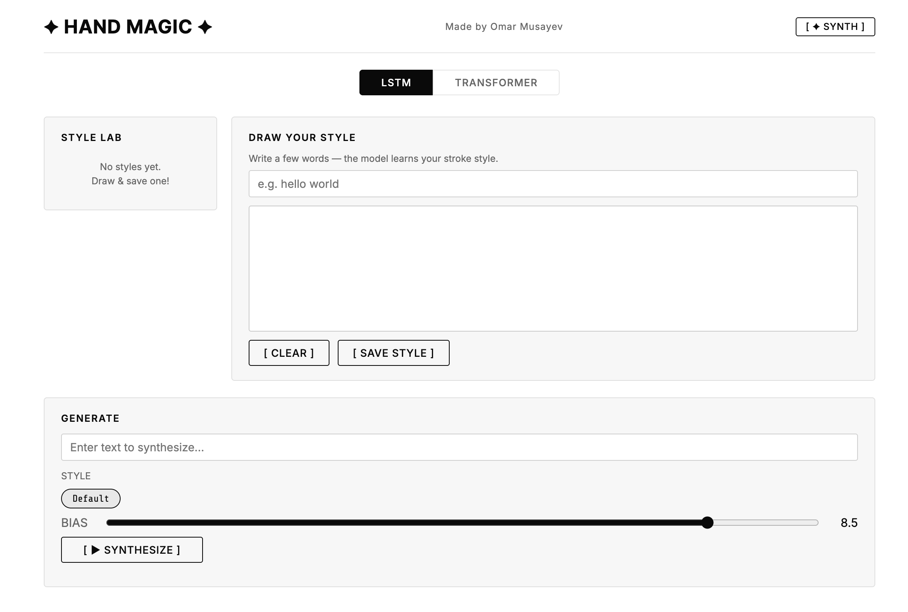
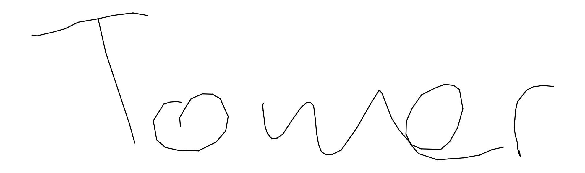
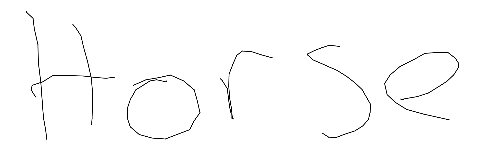
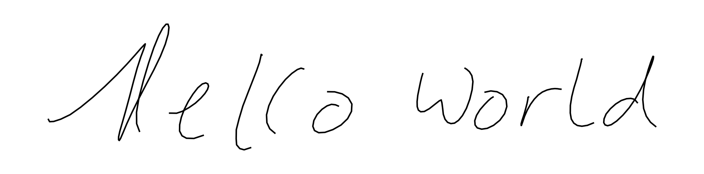
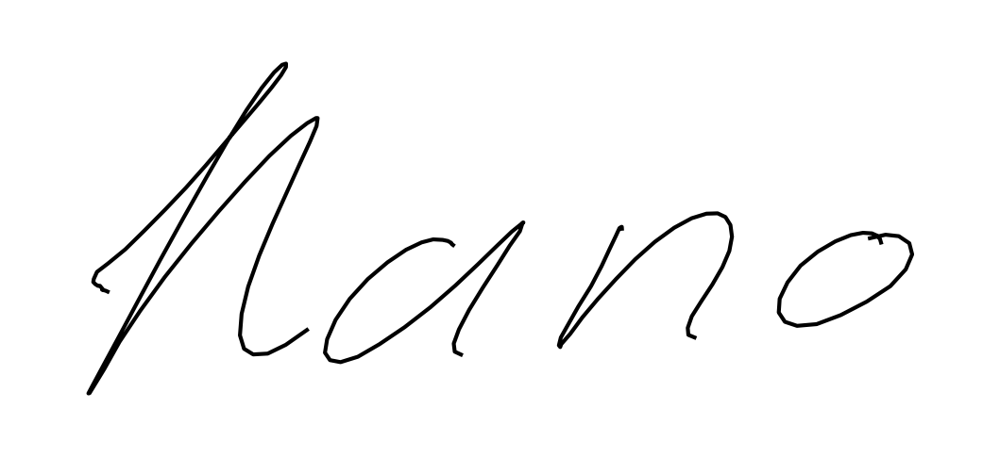

# AI Handwriting Generator

> Generate realistic handwriting from any text using deep learning — with style transfer from your own handwriting.
> Built by **Omar Musayev**

[](https://python.org)
[](https://pytorch.org)
[](https://fastapi.tiangolo.com)
[](LICENSE)

**Live demo: [hand-magic.com](https://hand-magic.com/)**

<p align="center">
  <a href="https://hand-magic.com/">
    
  </a>
</p>

---

## What is this?

A web app that generates realistic handwritten text from any input string. Two model architectures you can toggle between in the UI:

- **LSTM + Gaussian Mixture Model** — classic approach ([Graves 2013](https://arxiv.org/abs/1308.0850)), supports style transfer from your own handwriting drawn on-canvas
- **Transformer + Polar Tokenizer** — cross-attention GPT decoder trained on IAM On-Line Handwriting DB, generates multiple unique samples via top-k sampling

---

## Quick Start

```bash
git clone https://github.com/OmarMusayev/ai-handwriting-generator.git
cd ai-handwriting-generator
python -m venv env && source env/bin/activate
pip install -r requirements.txt
cp .env.example .env
python -m uvicorn main:app --host 0.0.0.0 --port 8000
```

Open `http://localhost:8000`

Everything needed to run is in the repo — both model weights are included in `weights/`.

---

## Features

- **Two model modes** — switch between LSTM and Transformer in the UI
- **Style transfer** (LSTM) — draw on canvas, model mimics your handwriting
- **Multi-sample generation** (Transformer) — each sample is unique via top-k=20 sampling
- **No login required** — session persists via cookie
- **Multi-style management** — save, rename, delete up to 10 styles
- **Async generation** — samples stream progressively as each finishes

---

## Samples

**Transformer model** (top-k=20 sampling, each generation is unique):

<p>
  
  
</p>

**LSTM model** (with style transfer from drawn handwriting):

<p>
  
  
</p>

---

## How It Works

### LSTM Model

A 3-layer LSTM (hidden_size=400) with a soft Gaussian attention window (K=10 components) over the input text. At each step it predicts a mixture of 20 bivariate Gaussians for the next pen offset `(dx, dy)` plus an end-of-stroke probability. Style transfer works by priming the model with your drawn strokes.

### Transformer Model

A 6-layer cross-attention GPT decoder (d_model=384, 6 heads). Text is encoded character-by-character. Strokes are tokenized into discrete polar coordinate tokens — each offset becomes 2 tokens: an angle token (128 bins) and a radius+pen token (64 bins). Generation is autoregressive with top-k=20 sampling at temperature 0.9.

For full architecture details, hyperparameters, data pipeline, and retraining instructions, see **[docs/TRAINING.md](docs/TRAINING.md)**.

---

## Project Structure

```
ai-handwriting-generator/
├── main.py                  # FastAPI app entry point
├── generate.py              # CLI generation
├── train.py                 # LSTM training script
├── app/
│   ├── api/                 # REST endpoints (styles, generate, jobs)
│   ├── core/                # Config, singletons, session management
│   ├── services/            # Generation workers, job store, cleanup
│   ├── static/              # CSS + JS frontend
│   └── templates/           # Jinja2 HTML
├── handwriting/             # Transformer package (training + inference)
│   ├── model.py             # CrossAttentionGPT (6-layer, 384-dim)
│   ├── training.py          # Training loop
│   ├── generation.py        # Token generation + plotting
│   ├── tokenizers.py        # Polar offset tokenizer (128 angle × 64 radius)
│   ├── data.py              # Text vocabulary + dataset
│   └── checkpoint.py        # Checkpoint loading
├── models/
│   └── models.py            # LSTM model (3-layer, 400-dim, 20 Gaussians)
├── utils/                   # Dataset, normalization, plotting
├── weights/
│   ├── lstm.pt              # LSTM best model (14MB)
│   └── transformer.pt       # Transformer best model (102MB, Git LFS)
├── data/
│   ├── sentences.txt        # Text vocabulary for LSTM
│   └── strokes.npy          # Stroke data for LSTM normalization
├── scripts/transformer/     # Transformer training pipeline
│   ├── train.py             # Training entry point
│   ├── build_iam_ondb_dataset.py
│   ├── configs/experiments/ # Experiment configs (JSON)
│   └── ...
├── docs/
│   ├── TRAINING.md          # Full training guide
│   └── samples/             # Sample images
├── requirements.txt
├── Dockerfile
├── docker-compose.yml
└── .env.example
```

---

## Environment Variables

| Variable | Default | Description |
|---|---|---|
| `MODEL_PATH` | `weights/lstm.pt` | LSTM checkpoint |
| `TRANSFORMER_CHECKPOINT` | `weights/transformer.pt` | Transformer checkpoint |
| `DATA_PATH` | `./data/` | Path to LSTM stroke data |
| `DISK_STORAGE_PATH` | `./disk` | Session/style/job storage |
| `MAX_GEN_STEPS` | `600` | Max LSTM generation steps |
| `N_SAMPLES` | `5` | Samples per request |
| `SESSION_TTL_DAYS` | `7` | Session cookie lifetime |

---

## Training Data

The model weights are included — you don't need training data to run the app. For retraining details, see [docs/TRAINING.md](docs/TRAINING.md).

| Dataset | Source | Used for |
|---|---|---|
| [IAM On-Line Handwriting DB](https://fki.tic.heia-fr.ch/databases/iam-on-line-handwriting-database) | FKI Group, Univ. of Bern (free registration) | Transformer training |
| [DeepWriting](https://ait.ethz.ch/deepwriting) | ETH Zurich (Aksan et al. 2018) | Additional LSTM data |
| Graves dataset | Included in `data/` | LSTM training |

---

## References

- Alex Graves — [Generating Sequences With Recurrent Neural Networks (2013)](https://arxiv.org/abs/1308.0850)
- Aksan et al. — [DeepWriting: Making Digital Ink Editable via Deep Generative Modeling (2018)](https://ait.ethz.ch/deepwriting)
- IAM On-Line Handwriting Database — [FKI Group, University of Bern](https://fki.tic.heia-fr.ch/databases/iam-on-line-handwriting-database)

---

## License

MIT — see [LICENSE](LICENSE).
